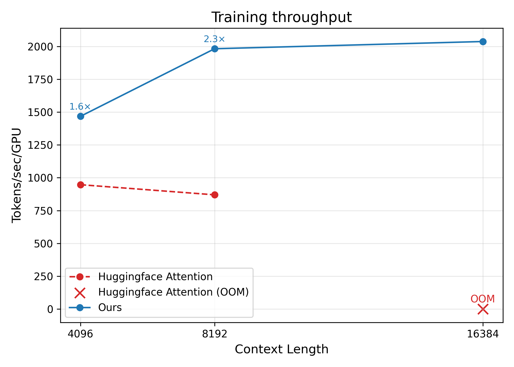

# Efficient Finetuning for OpenAI GPT-OSS

Finetune OpenAI's open-source GPT-OSS models ([gpt-oss-20b](https://huggingface.co/openai/gpt-oss-20b) and [gpt-oss-120b](https://huggingface.co/openai/gpt-oss-120b)) **up to 2.5× faster** with our custom Triton-based flash attention kernels.  
Supports **long-context fully finetuning (up to 16K tokens)** — all on a **single node**.  

## Why This Matters

Current flash attention libraries don't fully support GPT-OSS because the backward pass is missing.
We provide **custom Triton-based flash attention kernels** that unlock faster, memory-efficient training, and optimized for GPT-OSS:  

**Key Benefits:**
  - **2.5× throughput gains**  
  - **Lower memory usage**  
  - **Efficient finetuning with long context**  

Detailed implementation is available in [`attention_kernel.py`](./attention_kernel.py).  

## Benchmark Results

Training throughput improvements (tokens/sec per GPU):  

  

## Usage

Patch Hugging Face’s default GPT-OSS attention with our optimized kernels:

```
from transformers.models.gpt_oss import modeling_gpt_oss
from attention_kernel import triton_flash_attention

modeling_gpt_oss.eager_attention_forward = triton_flash_attention
```

Or simply use our helper:

```python
import patching
patch_flash_attention()
```

## Installation

Create a Python 3.11 virtual environment and install dependencies:

```sh
# Create and activate the virtual environment
uv venv gpt-oss --python 3.11
source gpt-oss/bin/activate

# Install dependencies
uv pip install --upgrade pip
uv pip install torch==2.8.0 torchvision torchaudio --index-url https://download.pytorch.org/whl/test/cu128
uv pip install -r requirements.txt
```


## Training

**Full Finetuning** and **parameter-efficient (LoRA)** finetuning.


1. Full Finetuning (multi-GPU)

```sh
accelerate launch --config_file configs/zero3.yaml sft.py --config configs/sft_full.yaml
```

2. LoRA Finetuning (single-GPU)
```sh
python sft.py --config configs/sft_lora.yaml
```

To customize training, modify the config files (sft_lora.yaml or sft_full.yaml) or override parameters directly from the command line.

### Acknowledgements

This work builds upon the GPT-OSS Recipes codebase from Hugging Face:
https://github.com/huggingface/gpt-oss-recipes
